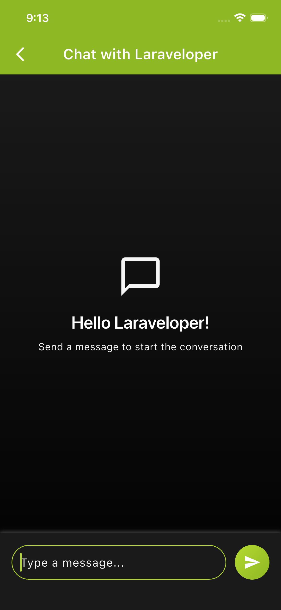
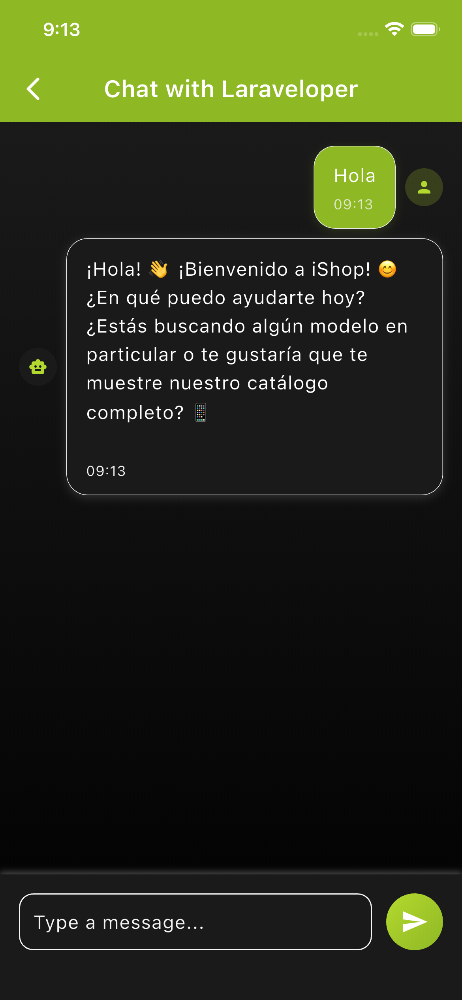
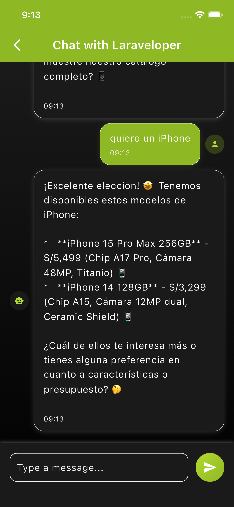

# Chat App N8n

Flutter demo app that integrates a chatbot orchestrated with n8n via HTTP (Dio). Designed for a technical talk and as a base to experiment with a minimal chat flow, internationalization, and a feature-based architecture.

## Table of Contents
- Overview and goals
- Requirements
- Installation
- Running (flavors and targets)
- Project architecture
- n8n integration (API)
- Internationalization (l10n)
- Dio example (sample UI)
- Screenshots
- Status and next steps
- Useful commands

## Overview and goals
This demo shows how to decouple the app from the backend using n8n for the bot logic, consumed from Flutter through a simple HTTP call. The goal is for any developer to rapidly prototype a chatbot without building a complex backend.

Complementary documents:
- `IA/PRD.md`: Product requirements and talk context.
- `IA/TRD.md`: Technical decisions, architecture, and inter-feature flow.
- `IA/PROGRESS.md`: Plan, phases, and current project status.

## Requirements
- Flutter SDK (stable 3.x or newer recommended)
- Dart SDK (bundled with Flutter)
- Project dependencies installed

## Installation
1. Clone the repository
2. Install dependencies:
   - `flutter pub get`

## Running (flavors and targets)
The project defines multiple entrypoints and Android/iOS flavors for different scenarios.

- Production (full app):
  - `flutter run -t lib/main_production.dart`
  - Android/iOS with flavor:
    - Android: `flutter run -t lib/main_production.dart --flavor production`
    - iOS: `flutter run -t lib/main_production.dart --flavor production`

- Staging (full app):
  - `flutter run -t lib/main_staging.dart`
  - With flavor:
    - Android/iOS: `flutter run -t lib/main_staging.dart --flavor staging`

- Development (Dio sample UI):
  - `flutter run -t lib/main_development.dart`
  - Web (recommended for quick try): `flutter run -t lib/main_development.dart -d chrome`
  - With flavor (Android/iOS): `flutter run -t lib/main_development.dart --flavor development`

> Note: On Web, Gradle flavors do not apply, but you can still use the development target to open the sample screen.

## Project architecture
Feature-based structure and layers:

```
lib/
├── bootstrap.dart                  # App bootstrap with AppBlocObserver and runApp
├── app/
│   └── view/app.dart               # MaterialApp, theme, router and l10n
├── main_development.dart           # Entry point for Dio sample UI
├── main_staging.dart               # Entry point for full app (staging)
├── main_production.dart            # Entry point for full app (production)
└── src/
    ├── core/                       # Shared code
    │   ├── constants/              # API constants, etc.
    │   ├── di/                     # GetIt (AppModules)
    │   ├── navigation/             # Centralized router
    │   ├── network/                # Dio client and configuration
    │   ├── shared/                 # Shared resources and widgets
    │   └── theme/                  # Theme and styles
    └── features/
        ├── welcome/                # Welcome feature
        │   └── presentation/
        │       └── screens/welcome_screen.dart
        ├── chat/                   # Main chat feature
        │   ├── domain/             # Entities and contracts
        │   ├── infrastructure/     # Service implementations
        │   └── presentation/       # Cubit, UI and widgets
        └── examples/
            └── dio_basic_example/  # Sample Dio UI and logic
                ├── dio_basic_example_screen.dart
                └── dio_basic_example.dart
```

- Navigation: `src/core/navigation/router.dart` defines routes `/` (Welcome) and `/chat`.
- Dependency injection: `src/core/di/app_modules.dart` registers `Dio`, `DioClient`, `ChatServiceImpl`, and `ChatCubit` in GetIt.
- App bootstrap: `bootstrap.dart` sets a global `BlocObserver` and calls `runApp` with the selected target.

## n8n integration (API)
- API constants: `src/core/constants/api_constants.dart`
  - `baseUrl`: base URL for the n8n webhook
  - `chatEndpoint`: bot endpoint path (e.g. `/webhook/chat-bot2`)
  - Default timeouts and headers

- HTTP client:
  - `src/core/network/dio_client.dart`: configures `Dio` with logging and error translation.

- Chat service:
  - Contract: `src/features/chat/domain/services/chat_service.dart`
  - Implementation: `src/features/chat/infrastructure/services/chat_service_impl.dart`
  - Usage: consumed by `ChatCubit` in `ChatScreen`.

To point to another webhook or change the endpoint, adjust `ApiConstants.baseUrl` and `ApiConstants.chatEndpoint`.

## Internationalization (l10n)
- Configuration: `l10n.yaml`, `lib/l10n/arb/app_en.arb`, `lib/l10n/arb/app_es.arb`
- Delegates and locales: defined in `app/view/app.dart`
- Access alias: `context.loc` (alias of `context.l10n`) to get localized strings.

## Dio example (sample UI)
Sample screen to test an HTTP call with `Dio` to the n8n webhook.

- Entry point: `lib/main_development.dart` (opens the sample screen)
- UI: `lib/src/features/examples/dio_basic_example/dio_basic_example_screen.dart`
- Logic: `lib/src/features/examples/dio_basic_example/dio_basic_example.dart` (`runDioExample(...)`)

Quick Web run:

```
flutter run -t lib/main_development.dart -d chrome
```

You can:
- Write a message, user, and `sessionId`
- Send with Dio
- See the result, copy it, and regenerate `sessionId`

## Screenshots
Attach four screenshots here. Suggested file layout:

```
docs/
└── screenshots/
    ├── 01_welcome.png
    ├── 02_chat_empty.png
    ├── 03_chat_reply.png
    └── 04_chat_catalog.png
```

Rendered previews with fixed height (365):
| ChatBot | Message |
|---------------|--------|
|<p align="center">
  
</p> | |
|<p align="center">
  
</p> | |


<p align="center">
  
  
  
  
</p>

If you prefer a different size, change the `height` attribute (GitHub Markdown supports inline HTML).

Table layout with two columns:

| ChatBot | Message |
|---|---|
|  |  |
|  |  |

## Status and next steps
Summary (see `IA/PROGRESS.md` for details):
- Completed: core architecture, Welcome, Chat (UI/state/service), n8n integration, l10n, and theme refinements.
- In progress: end-to-end testing, n8n workflow fine-tuning, and final code cleanup.

## Useful commands
- Install dependencies: `flutter pub get`
- Formatting: `dart format .`
- Run app (production): `flutter run -t lib/main_production.dart`
- Run app (staging): `flutter run -t lib/main_staging.dart`
- Run sample (development, web): `flutter run -t lib/main_development.dart -d chrome`
- Regenerate Freezed/JSON files (if applicable):
  - `flutter pub run build_runner build --delete-conflicting-outputs`

## License
This project is provided for educational and demonstration purposes. Add a formal license if you plan to distribute it.
